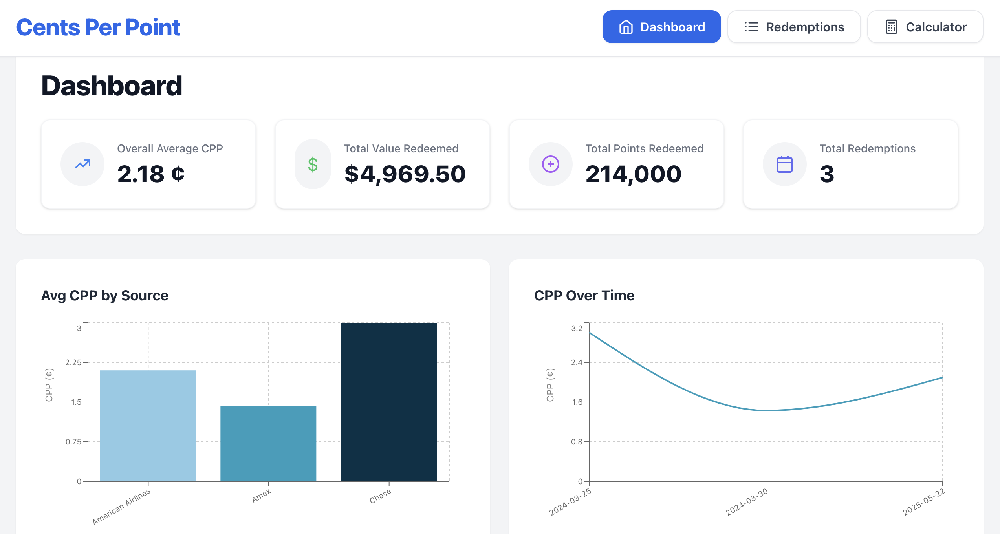
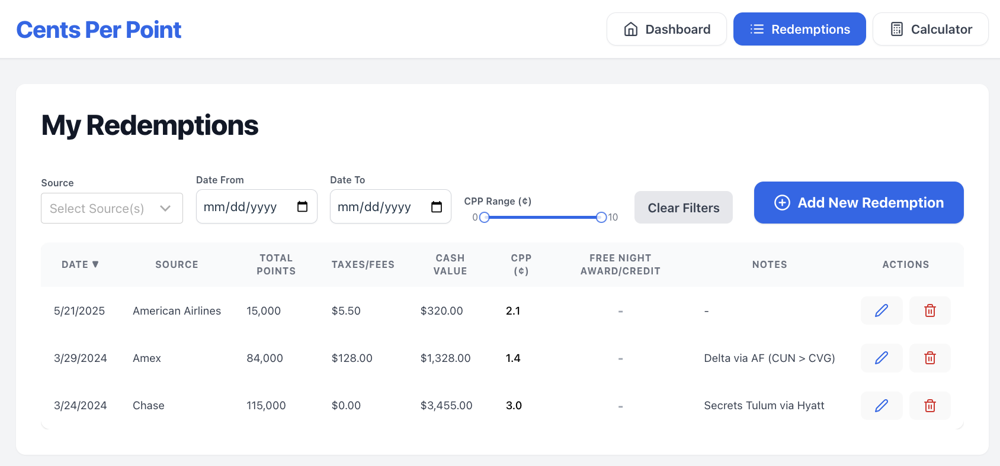
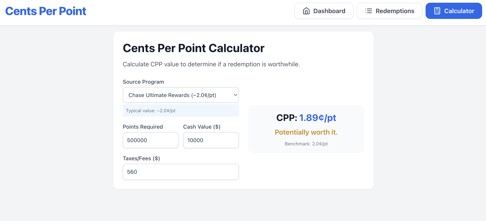

# Cents Per Point

[](https://github.com/stephtanner1/Cost%20Per%20Point/releases)
[](https://hub.docker.com/u/stephtanner1)
[](https://opensource.org/licenses/MIT)
[](https://reactjs.org/)
[](https://nodejs.org/)
[](https://postgresql.org/)

> A self-hosted web application to track credit card point redemptions and calculate Cents Per Point (CPP) values to optimize your rewards strategy.



## 📋 Table of Contents

- [Features](#-features)
- [Screenshots](#-screenshots)
- [Roadmap](#️-roadmap)
- [Quick Start](#-quick-start)
- [Installation](#-installation)
- [Migration from SQLite](#-migration-from-sqlite)
- [Configuration](#-configuration)
- [API Documentation](#-api-documentation)
- [Contributing](#-contributing)
- [License](#-license)
- [Support](#-support)

## ✨ Features

- 📊 **Track Redemptions** - Log point redemptions with dates, sources, values, and notes
- 🧮 **Calculate CPP** - Automatically calculate Cents Per Point for each redemption
- 📈 **Compare Programs** - Analyze performance across different credit card and loyalty programs
- 📉 **Visualize Data** - Interactive charts and analytics to understand redemption patterns
- 🎫 **Travel Credit Support** - Track both point redemptions and travel credit usage
- 🔒 **Privacy First** - All data stored locally, no external data transmission
- 🐳 **Docker Ready** - Easy deployment with Docker Compose
- 🗄️ **PostgreSQL Database** - Robust, scalable database with automatic migration from SQLite
- 🔄 **Automatic Migration** - Seamlessly upgrade from previous SQLite versions
- 📱 **Responsive Design** - Works on desktop, tablet, and mobile devices

## 📸 Screenshots

### 📊 Dashboard - Analytics & Insights
Track your overall performance with comprehensive analytics and beautiful visualizations.


### 📋 Redemptions Management
Easily manage all your point redemptions with powerful filtering and search capabilities.



### 🧮 CPP Calculator
Calculate Cents Per Point values instantly to make informed redemption decisions.



## 🗺️ Roadmap

We're continuously improving Cents Per Point based on community feedback. Here's what's planned:

### 🎯 Near Term (Next 3-6 months)
- **Enhanced Analytics** - Advanced CPP trends, program performance insights, and custom report builder
- **Bulk Import/Export** - CSV import for bulk data entry and comprehensive export options

### 🚀 Medium Term (6-12 months)
- **Point Balance Tracking** - Monitor current balances and expiration dates across programs
- **Multi-User Support** - Family/household account management with shared tracking

### 💡 Long Term (12+ months)
- **Progressive Web App** - Mobile app experience with offline capabilities

> 💬 Have ideas for new features? [Open an issue](https://github.com/stephtanner1/Cost%20Per%20Point/issues) to share your suggestions!

## 🚀 Quick Start

Get up and running in under 2 minutes:

```bash
# 1. Download the docker-compose file
curl -o docker-compose.yml https://raw.githubusercontent.com/stephtanner1/Cost%20Per%20Point/main/docker-compose.yml

# 2. Start the application
docker-compose up -d

# 3. Open your browser
open http://localhost:3000
```

That's it! 🎉

## 📦 Installation

### Prerequisites

- [Docker](https://docs.docker.com/get-docker/) and [Docker Compose](https://docs.docker.com/compose/install/)
- 4GB RAM minimum (for PostgreSQL)
- 2GB free disk space

### Method 1: Docker Compose (Recommended)

1. **Download and start:**
   ```bash
   curl -o docker-compose.yml https://raw.githubusercontent.com/stephtanner1/Cost%20Per%20Point/main/docker-compose.yml
   docker-compose up -d
   ```

   Or create the file manually:
   ```yaml
   services:
     postgres:
       image: postgres:15-alpine
       environment:
         POSTGRES_DB: cpp_database
         POSTGRES_USER: postgres
         POSTGRES_PASSWORD: ${DB_PASSWORD:-securepassword123}
       volumes:
         - postgres_data:/var/lib/postgresql/data
       ports:
         - "5432:5432"
       restart: unless-stopped
       healthcheck:
         test: ["CMD-SHELL", "pg_isready -U postgres"]
         interval: 30s
         timeout: 10s
         retries: 3

     backend:
       image: stephtanner1/cpp-backend
       environment:
         DB_HOST: postgres
         DB_NAME: cpp_database
         DB_USER: postgres
         DB_PASSWORD: ${DB_PASSWORD:-securepassword123}
         DB_PORT: 5432
       ports:
         - "5000:5000"
       # Uncomment the lines below if migrating from previous version with SQLite
       # volumes:
         # - backend_data:/app/data
       depends_on:
         postgres:
           condition: service_healthy
       restart: unless-stopped

     frontend:
       image: stephtanner1/cpp-frontend
       ports:
         - "3000:3000"
       depends_on:
         - backend
       restart: unless-stopped

   volumes:
     postgres_data:
     # Uncomment the line below if migrating from SQLite
     # backend_data:
   ```

2. **Access the application:**
   - Frontend: http://localhost:3000
   - Backend API: http://localhost:5000
   - Health Check: http://localhost:5000/health

### Method 2: From Source

```bash
# Clone the repository
git clone https://github.com/stephtanner1/Cost%20Per%20Point.git
cd Cost%20Per%20Point

# Start with Docker Compose
docker-compose up -d
```

## 🔄 Migration from SQLite

Upgrading from a previous SQLite version? No problem! The application automatically detects and migrates your existing data.

### For Existing Users

1. **Download the new compose file:**
   ```bash
   curl -o docker-compose.yml https://raw.githubusercontent.com/stephtanner1/Cost%20Per%20Point/main/docker-compose.yml
   ```

2. **Edit the compose file to uncomment volume lines:**
   
   In the backend service, uncomment:
   ```yaml
   volumes:
     - backend_data:/app/data  # Replace with your volume name
   ```
   
   In the volumes section, uncomment:
   ```yaml
   backend_data:  # Replace with your volume name
   ```

3. **Start the application:**
   ```bash
   docker-compose up -d
   ```

4. **Verify migration:**
   ```bash
   curl http://localhost:5000/health
   ```

### Migration Process

- ✅ **Automatic detection** of SQLite database
- ✅ **Safe migration** with transaction rollback on failure
- ✅ **Backup creation** of original SQLite file
- ✅ **Data verification** after migration
- ✅ **One-time process** with migration flag to prevent re-runs

## ⚙️ Configuration

### Environment Variables

Create a `.env` file for custom configuration:

```bash
# Database password (recommended for production)
DB_PASSWORD=your-secure-password
```

### Default Configuration

| Variable | Description | Default |
|----------|-------------|---------|
| `DB_PASSWORD` | PostgreSQL password | `securepassword123` |
| `DB_HOST` | Database host | `postgres` |
| `DB_NAME` | Database name | `cpp_database` |
| `DB_USER` | Database user | `postgres` |
| `DB_PORT` | Database port | `5432` |

### Ports

| Service | Port | Description |
|---------|------|-------------|
| Frontend | 3000 | Web interface |
| Backend | 5000 | REST API |
| PostgreSQL | 5432 | Database (internal) |

### Data Persistence

- **Database**: PostgreSQL with persistent volume storage
- **Volume**: `postgres_data` stores all application data
- **Backup**: Use `docker-compose exec postgres pg_dump` for backups

## 📚 API Documentation

### Base URL
```
http://localhost:5000/api
```

### Health Check
```bash
curl http://localhost:5000/health
```

Response includes database status and migration information:
```json
{
  "status": "OK",
  "database": "PostgreSQL",
  "migration": {
    "status": "completed",
    "migratedCount": 150,
    "timestamp": "2024-01-15T10:30:00.000Z"
  }
}
```

### Endpoints

#### Redemptions

| Method | Endpoint | Description |
|--------|----------|-------------|
| `GET` | `/redemptions` | Get all redemptions |
| `POST` | `/redemptions` | Create new redemption |
| `GET` | `/redemptions/:id` | Get single redemption |
| `PUT` | `/redemptions/:id` | Update redemption |
| `DELETE` | `/redemptions/:id` | Delete redemption |

#### Example Request

```bash
# Create a new redemption
curl -X POST http://localhost:5000/api/redemptions \
  -H "Content-Type: application/json" \
  -d '{
    "date": "2024-01-15",
    "source": "Chase",
    "points": 50000,
    "value": 750,
    "taxes": 50,
    "notes": "Flight to Tokyo"
  }'
```

## 🤝 Contributing

We welcome contributions! Please see our [Contributing Guide](CONTRIBUTING.md) for details.

### Quick Start for Contributors

1. Fork the repository
2. Create a feature branch: `git checkout -b feature/amazing-feature`
3. Make your changes
4. Test locally: `docker-compose -f docker-compose.dev.yml up --build`
5. Commit: `git commit -m 'Add amazing feature'`
6. Push: `git push origin feature/amazing-feature`
7. Open a Pull Request

## 📄 License

This project is licensed under the MIT License - see the [LICENSE](LICENSE) file for details.

## 💬 Support

- 📖 **Documentation**: Check this README and [Deployment Guide](DEPLOYMENT.md)
- 🐛 **Bug Reports**: [Open an issue](https://github.com/stephtanner1/Cost%20Per%20Point/issues)
- 💡 **Feature Requests**: [Open an issue](https://github.com/stephtanner1/Cost%20Per%20Point/issues)
- 🔄 **Migration Help**: See [Deployment Guide](DEPLOYMENT.md) for detailed migration instructions

---

<div align="center">

**⭐ Star this repo if you find it helpful!**

Made with ❤️ for the points and miles community

[Report Bug](https://github.com/stephtanner1/Cost%20Per%20Point/issues) · [Request Feature](https://github.com/stephtanner1/Cost%20Per%20Point/issues)

</div>